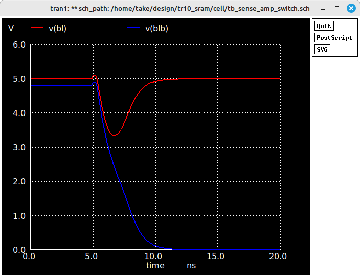
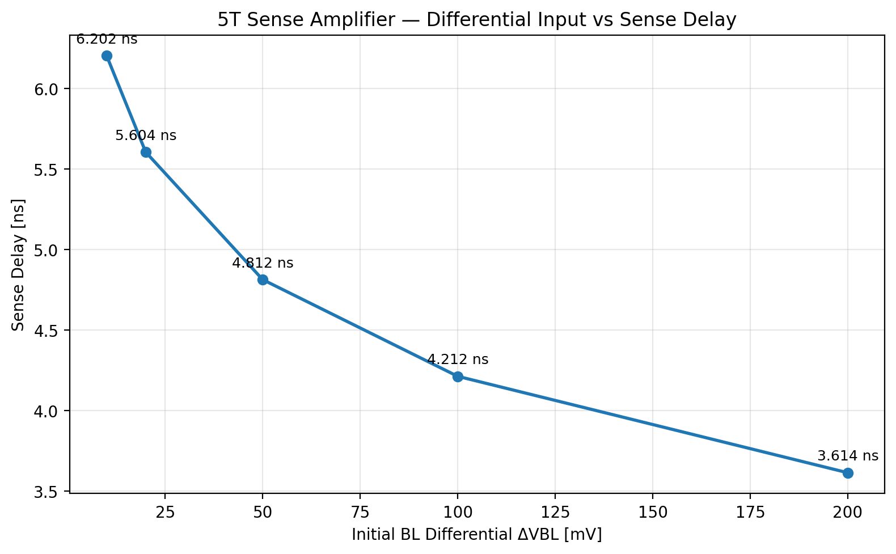
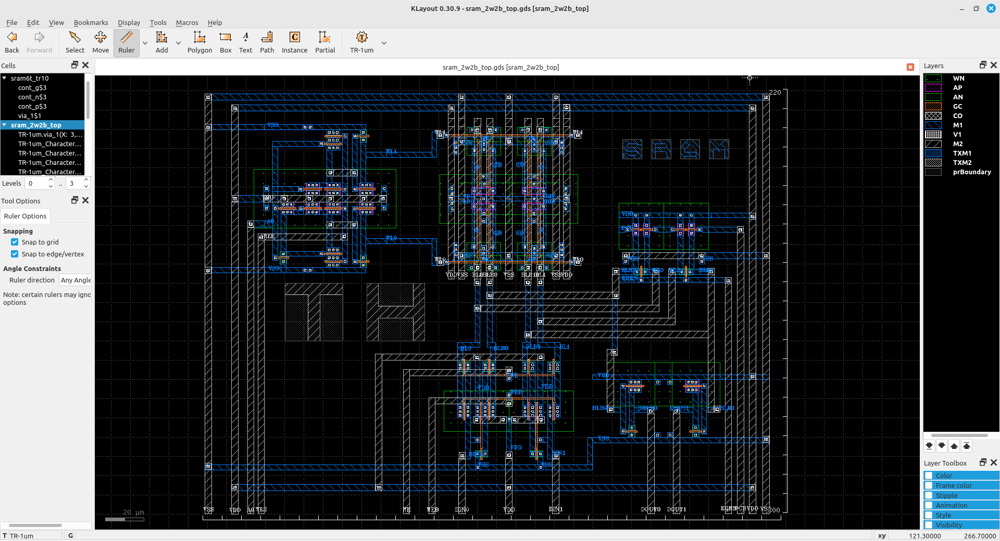

# TR-10 2-word × 2-bit SRAM

OpenSUSI TR10 PDKを使用し、**6T SRAMセルからトランジスタレベルで設計した 2-word × 2-bit SRAM**です。

SRAMをブラックボックスとして使用するのではなく、6T SRAM Cell、シミュレーション、2-word × 2-bit Array、Decoder、Write Driver、Precharge / Equalize、Read回路、レイアウト、LVSまでを段階的に構築しました。

Read回路では**5T Sense Amplifierを設計・定量評価**したうえで、今回の小規模SRAMへの統合結果を踏まえ、最終Topでは**CMOS Read Buffer（インバータ受け）**を採用しています。

> **Think, Build, Discuss.**  
> **Fail → Analyze → Improve.**

---

## Deliverables

OpenSUSI TR10 MPWへの投稿に向け、以下を提出物として整理しています。

| Deliverable | File / Description |
|---|---|
| Circuit Schematic | `sram_2w2b_top.sch` |
| Simulation Schematics | Hold / Write / Read / Sense Amplifier testbenches |
| Layout / GDS | `sram_2w2b_top.gds` |
| Design Documentation | 本README：仕様、設計方針、シミュレーション結果、工夫・アピールポイント |

---

## 1. Overview

今回の目的は、まず小規模SRAMを実際に作り、**SRAMがどのように設計され、どのようにRead / Writeされるのかを回路からレイアウトまで理解・実証すること**です。

```text
Transistor
   ↓
6T SRAM Cell
   ↓
Simulation / Characterization
   ↓
2-word × 2-bit Array
   ↓
Decoder / Write Driver / Precharge
   ↓
Read Path Evaluation
   ├─ 5T Sense Amplifier
   └─ CMOS Read Buffer  ← Final Top
   ↓
Top Layout
   ↓
LVS
```

現在、**6T SRAM Core、Decoder、Write Driver、Precharge / Equalize、Read Bufferを統合した 2-word × 2-bit SRAM Top LayoutでLVS clean**を確認しています。

---

## 2. SRAM Specification

| Item | Specification |
|---|---|
| Process / PDK | OpenSUSI-TR10 PDK |
| Schematic Editor | Xschem |
| Simulator | ngspice |
| Layout Editor | KLayout |
| Supply Voltage | 5 V |
| Minimum Gate Length | 1.0 µm |
| SRAM Cell | 6T |
| Memory Organization | 2-word × 2-bit |
| Number of SRAM Cells | 4 |
| Read Architecture | BL / BLB + CMOS Read Buffer |
| Sense Amplifier | 5T方式を設計・評価、最終Topでは不採用 |
| Peripheral Circuits | Decoder / Write Driver / Precharge-EQ / Read Buffer |
| Top-level Pins | 12 pins |
| Layout Verification | LVS clean / Final submission DRC pending |

---

## 3. 6T SRAM Cell

基本となるSRAMセルは、クロスカップルされた2個のCMOSインバータと2個のAccess NMOSから構成する6T SRAMです。

```text
                 VDD
                  │
             ┌────┴────┐
             │         │
            PMOS      PMOS
             │ Q     QB│
             ├───\ /───┤
             │    X    │
             ├───/ \───┤
             │         │
            NMOS      NMOS
             │         │
             └────┬────┘
                  │
                 VSS

BL  ─── Access NMOS ─── Q
             │
             WL

BLB ─── Access NMOS ─── QB
             │
             WL
```

### Transistor Sizing

| Device | W | L |
|---|---:|---:|
| Pull-up PMOS | 3.4 µm | 1.0 µm |
| Access NMOS | 5.1 µm | 1.0 µm |
| Pull-down NMOS | 6.8 µm | 1.0 µm |

初期Cell ratio：

```text
Wpd : Wacc : Wpu = 6.8 : 5.1 : 3.4 = 2 : 1.5 : 1
```

---

## 4. 2-word × 2-bit SRAM Array

4個の6T SRAM Cellを使用して、2-word × 2-bitのSRAM Arrayを構成します。

```text
             BL0 / BLB0       BL1 / BLB1
                  │                 │

WL1 ───────── [CELL10]          [CELL11]

WL0 ───────── [CELL00]          [CELL01]

                  │                 │
                bit0              bit1
```

アドレスによってWL0 / WL1を選択し、2 bit単位でデータを扱います。

---

## 5. Simulation Schematics

6T SRAM Cellおよび周辺回路について、Xschem + ngspiceを使用して動作確認を行いました。

### 5.1 Hold

`tb_hold.sch`

WL非選択時に、SRAM Cell内部のQ / QBが記憶状態を保持できることを確認します。

### 5.2 Write

`tb_write.sch`

BL / BLBへ相補データを与え、WLをAssertすることでWrite 0 / Write 1動作を確認します。

### 5.3 Read

`tb_read.sch`

Read時のBL / BLBの電位変化を確認します。

```text
ΔVBL = |BL - BLB|
```

SRAM Cellが生成するBit Line差電圧を観測し、Read回路の検討に使用しました。

---

## 6. 5T Sense Amplifier Evaluation

Read回路の候補として**5T Sense Amplifier**を設計・評価しました。

SRAM CellのRead時にBL / BLBへ発生する差電圧 `ΔVBL` を増幅してデジタルレベルとして判定することを目的に、Sense Amplifier単体で特性を確認しました。

### 6.1 Transient Simulation



BL / BLBに初期差電圧を与えた過渡解析では、Sense動作によってBL / BLBが大きく分離することを確認しました。

### 6.2 Differential Input vs Sense Delay

Sense Amplifierへ与える初期BL差電圧 `ΔVBL` を変化させ、Sense Delayとの関係を評価しました。



| Initial BL Differential ΔVBL | Sense Delay |
|---:|---:|
| 10 mV | 6.202 ns |
| 20 mV | 5.604 ns |
| 50 mV | 4.812 ns |
| 100 mV | 4.212 ns |
| 200 mV | 3.614 ns |

入力差電圧が大きくなるほどSense Delayが短くなることを確認しました。

特に、**ΔVBL = 10 mVの微小差動入力についてもSense動作を確認**しています。この結果から、SRAM Cellが生成するBit Line差電圧とSense Amplifierの起動タイミングの関係がRead動作に重要であることが分かります。

### 6.3 Why the Sense Amplifier Was Not Used in the Final Top

Sense Amplifier単体では微小差動入力に対するSense動作を確認できました。一方、SRAMへ統合した際にはSense Amplifierの入力負荷がBL / BLBへ影響するため、今回の2-word × 2-bit SRAMでは、よりシンプルで安定したRead Pathを優先しました。

その結果、最終TopではSense Amplifierを採用せず、**BLBをCMOS Read Bufferで受ける構成**を選択しました。

この評価結果は、次回のBitcell、Bit Line容量、Sense Enable timing、Sense Amplifier sizingを改善するための設計データとして活用します。

---

## 7. Final Read Path

最終Topでは**CMOS Read Buffer（インバータ受け）**を採用しています。

```text
       Precharge / Equalize
               │
           BL / BLB
               │
      2-word × 2-bit SRAM
               │
             BLB
               │
        CMOS Read Buffer
               │
         DOUT0 / DOUT1
```

基本Read sequence：

1. BL / BLBをPrecharge / Equalize
2. Word LineをAssert
3. SRAM CellによってBL / BLBに電位差を生成
4. BLBをCMOS Read Bufferで受ける
5. DOUT0 / DOUT1を確定

最終統合シミュレーションではWord0 / Word1のRead動作を確認し、Read accessは約 **1.25 ns** でした。

---

## 8. Layout

### 8.1 SRAM Cell Layout

6T SRAM CellをKLayoutでレイアウトし、2-word × 2-bit Arrayの基本セルとして使用します。

### 8.2 2-word × 2-bit Array Layout

4個のSRAM Cellを配置し、WLおよびBL / BLBを共有するArray構造を構成します。

### 8.3 SRAM Top Layout

以下の5ブロックを統合したSRAM Top Layoutを作成しました。

```text
SRAM 2-word × 2-bit Core
Decoder
Write Driver
Precharge / Equalize
Read Buffer
```

GDS：

```text
layout/2word_x_2bit/sram_2w2b_top.gds
```



Top Layoutは約 **300 µm × 220 µm** 内に、6T SRAM Core、Decoder、Write Driver、Precharge / Equalize、Read Bufferを統合しています。現状のTop-level I/Oは **12 pins** です。

### 8.4 Layout Verification

各ブロックおよびTop全体について回路図との比較を行い、**Top-level LVS clean**を確認しています。

```text
6T SRAM Core
        +
Decoder / Write Driver
        +
Precharge / Equalize
        +
Read Buffer
        ↓
Top Layout
        ↓
LVS
        ↓
LVS CLEAN
```

---

## 9. Design Highlights

### Designed from the 6T Bitcell Up

既成SRAM Macroを使用せず、6T SRAM Cellから2-word × 2-bit Array、周辺回路、Read Path、Top Layoutまでをトランジスタレベルから構築しました。

### Small but Complete SRAM Array

2-word × 2-bitという小規模な構成にすることで、SRAM Cell、Word Line、Bit Line、Decoder、Write Driver、Precharge / Equalize、Read回路の関係を追跡しやすくし、SRAM内部動作を回路レベルで確認できる構成としています。

### Quantitative Sense Amplifier Evaluation

5T Sense Amplifierは単純な動作確認だけでなく、**`ΔVBL = 10 mV ～ 200 mV`**まで入力差を変化させ、Sense Delayとの関係を定量評価しました。**10 mVの微小差動入力でもSense動作を確認**しています。

### Evaluate, Compare, and Choose the Read Path

Sense AmplifierとCMOS Read Bufferの両方を実際に検討しました。Sense Amplifierの評価結果を踏まえ、今回の小規模SRAMではBit Lineへの負荷と安定したRead動作を優先し、最終TopにCMOS Read Bufferを採用しました。

**「回路を追加したこと」ではなく、「評価結果をもとに最終回路を選択したこと」**を本設計の重要なポイントとしています。

### Layout to LVS Clean

回路シミュレーションだけで終わらせず、2-word × 2-bit SRAM Coreと周辺回路を実際にレイアウトし、Top Layoutまで統合して**LVS clean**を確認しました。

### Open Source EDA Flow

Xschem、ngspice、KLayoutを使用し、**Schematic → Simulation → Layout → LVS**までOpen Source EDAを中心とした設計フローで実施しています。

---

## 10. Current Status

```text
6T SRAM Cell
     ↓
2-word × 2-bit Array
     ↓
Decoder / Write Driver / Precharge-EQ
     ↓
5T Sense Amplifier Evaluation
     ↓
CMOS Read Buffer adopted
     ↓
SRAM Top Layout
     ↓
Top-level LVS
     ↓
LVS CLEAN  ← Current physical-design milestone

Final submission DRC  ← Next
```

---

## 11. Current Top-level I/O and Future Improvements

現在のTop-level I/Oは以下の12ピンです。

```text
Power
VDD, VSS

Input
A0, WLE
WE, WEB
PCB, EQEN
DIN0, DIN1

Output
DOUT0, DOUT1
```

今後は `WEB` や `EQEN` などの相補・制御信号を内部生成することで、外部ピン数を削減する余地があります。

今回の設計では、まず**実際に動作する小規模SRAMをTR-10で作り、測定可能なベースラインを構築すること**を優先しました。今後は以下を改善します。

- Bitcellレイアウトの面積・配線最適化
- 6T CellのPull-up / Access / Pull-down MOSのL/W最適化
- Sense Amplifierを含むRead Pathの再設計
- Bit Line負荷とSense Enable timingの最適化
- 外部ピン数の削減
- Word数 / Bit数を増やした大容量化

実際にTR-10で製造・測定した結果を次回設計へフィードバックし、キーとなる部分を段階的に改善していくことを目標とします。

---

## 12. Repository Structure

```text
tr10_sram/
│
├── Deliverables/
│
├── generic/
│
├── cell/
│   ├── MN.sym
│   ├── MP.sym
│   ├── sram6t_tr10.sch
│   ├── sram6t_tr10.sym
│   ├── tb_sram6t.sch
│   ├── tb_hold.sch
│   ├── tb_write.sch
│   ├── tb_read.sch
│   └── tb_snm.sch
│
├── array/
│   └── 2word_x_2bit/
│       ├── sram_2w2b.sch / .sym
│       ├── decoder.sch / .sym
│       ├── write_driver.sch / .sym
│       ├── precharge.sch / .sym
│       ├── read_buffer.sch / .sym
│       └── sram_2w2b_top.sch
│
├── layout/
│   ├── cell/
│   └── 2word_x_2bit/
│       └── sram_2w2b_top.gds
│
├── spice/
│   ├── cell/
│   └── array/
│
└── docs/
    └── images/
        ├── sa1.png
        ├── 5t_sense_amp_dvbl_vs_delay.png
        └── finalgds.png
```

---

## 13. Repository

`TAKE-HooJoo/tr10_sram`

---

## 14. Design Philosophy

最初から大規模・高性能なSRAM Macroを目指すのではなく、**小規模な回路を実際に作り、評価結果を次の設計へ反映する反復型の開発**を重視しています。

> **小さく作る → 動かす → 測る → 解析する → 改善する**

Sense Amplifierの評価からCMOS Read Bufferの採用に至った過程も、この設計方針の一例です。
