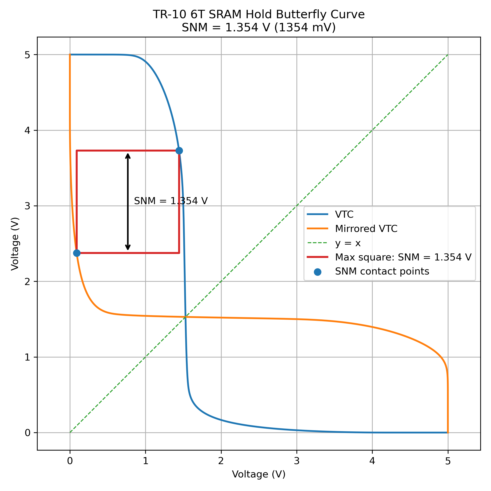
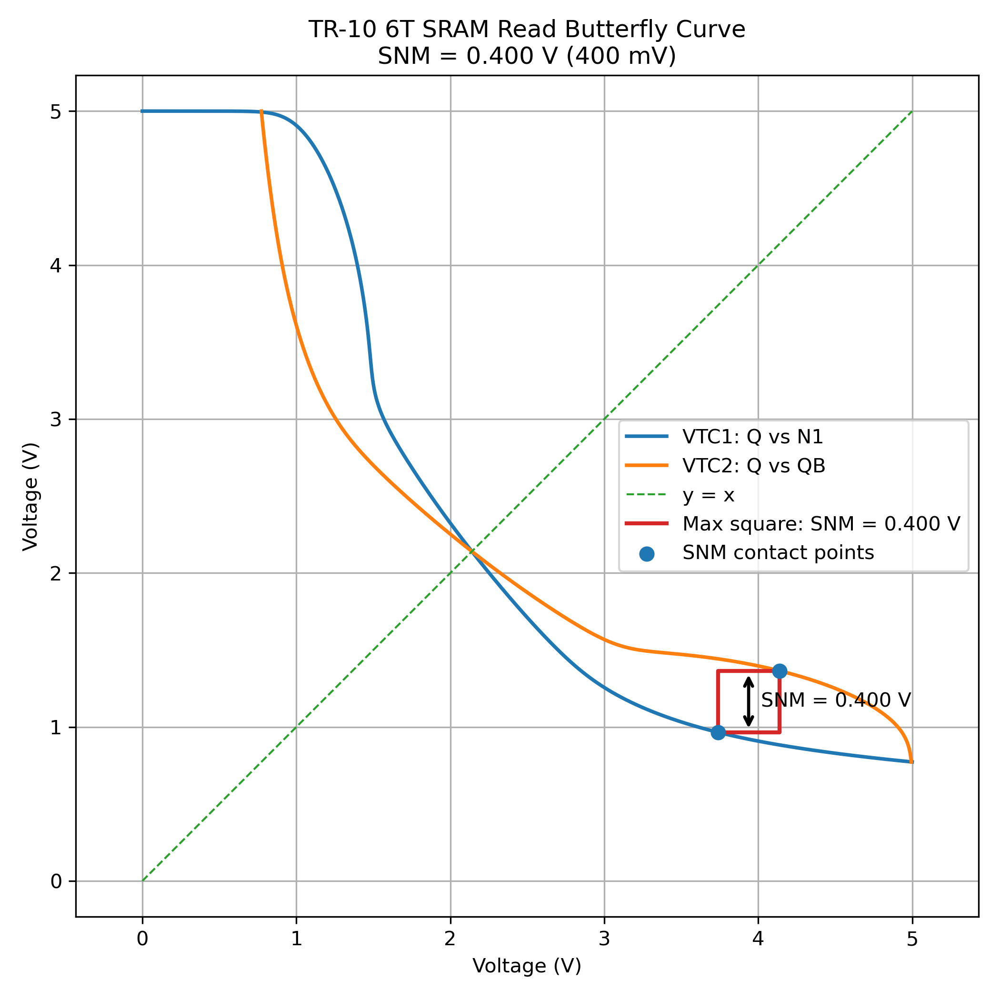

# はじめてのSRAM設計

OpenSUSI TR10 PDKを使用し、**6T
SRAMセルからトランジスタレベルで設計した 2-word × 2-bit SRAM**をベースラインとして、
さらに **8-word × 2-bit SRAM**へアレイ深さを拡張して評価しています。

SRAMをブラックボックスとして使用するのではなく、セル設計、シミュレーション、アレイ化、Decoder、Write
Driver、Precharge / Equalize、Read
Buffer、レイアウト、LVSまでを段階的に構築しました。Sense
Amplifierも設計・評価しましたが、SRAMの容量が小さく効果がわかりにくかったので、最終TopではRead Buffer（インバータ受け）としました。

> **Think, Build, Discuss.**\
> **Fail → Analyze → Improve.**

------------------------------------------------------------------------

## Submission Package

OpenSUSI TR10 MPWへの投稿に向けた提出物。

-   **Deliverables（提出物）**
    -   回路図　sram_2w2b_top.sch (Deliverablsフォルダ)
    -   レイアウト　sram_2w2b_top.gds(Deliverablsフォルダ)
    -   README.md　今回の工夫・アピールポイント


------------------------------------------------------------------------

## 1. Overview

今回は、小規模SRAMを作ることで、まずはSRAMってどうやって設計するんだろう？？を理解・実証することとしました。

``` text
Transistor
   ↓
6T SRAM Cell
   ↓
Simulation / Characterization
   ↓
2-word × 2-bit Array
   ↓
Decoder / Write Driver / Precharge
   ↓
Read Buffer
   ↓
Top Layout
   ↓
LVS
```

現在、**6T SRAM Core、Decoder、Write Driver、Precharge / Equalize、Read
Bufferを統合した 2-word × 2-bit SRAM Top LayoutでLVS
clean**となっています。

------------------------------------------------------------------------

## 2. SRAM Specification

  ------------------------------------------------------------------------
  Item                             Specification
  -------------------------------- ---------------------------------------
  Process / PDK                    OpenSUSI-TR10 PDK

  Schematic Editor                 Xschem

  Simulator                        ngspice

  Layout Editor                    KLayout

  Supply Voltage                   5 V

  Minimum Gate Length              1.0 µm

  SRAM Cell                        6T

  Memory Organization              2-word × 2-bit

  Number of SRAM Cells             4

  Read Architecture                BL / BLB + CMOS Read Buffer

  Sense Amplifier                  5T方式を設計・評価、最終Topでは不採用

  Peripheral Circuits              Decoder / Write Driver / Precharge-EQ /
                                   Read Buffer

  Top-level Pins                   12 pins (current design)

  Layout Verification              LVS clean / Final DRC pending
  ------------------------------------------------------------------------

------------------------------------------------------------------------

## 3. 6T SRAM Cell

基本となるSRAMセルは、クロスカップルされた2個のCMOSインバータと2個のAccess
NMOSから構成する6T SRAMです。

``` text
                 VDD
                  │
             ┌────┴────┐
             │         │
            PMOS      PMOS
             │ Q     QB│
             ├───\ /───┤
             │    X    │
             ├───/ \───┤
             │         │
            NMOS      NMOS
             │         │
             └────┬────┘
                  │
                 VSS

BL  ─── Access NMOS ─── Q
             │
             WL

BLB ─── Access NMOS ─── QB
             │
             WL
```

### Transistor Sizing

  Device                  W        L
  ---------------- -------- --------
  Pull-up PMOS       3.4 µm   1.0 µm
  Access NMOS        5.1 µm   1.0 µm
  Pull-down NMOS     6.8 µm   1.0 µm

Cell ratioは以下を初期条件としています。

``` text
Wpd : Wacc : Wpu = 6.8 : 5.1 : 3.4 = 2 : 1.5 : 1
```

------------------------------------------------------------------------

## 4. 2-word × 2-bit SRAM Array

4個の6T SRAMセルを使用して、2-word × 2-bitのSRAMアレイを構成します。

``` text
             BL0 / BLB0       BL1 / BLB1
                  │                 │

WL1 ───────── [CELL10]          [CELL11]

WL0 ───────── [CELL00]          [CELL01]


                  │                 │
                bit0              bit1
```

アドレスによってWL0 / WL1を選択し、2 bit単位でデータを扱います。

------------------------------------------------------------------------

## 5. Simulation Schematics

6T SRAM Cellおよび周辺回路について、Xschem +
ngspiceを使用して動作確認を行います。

### 5.1 Hold

`tb_hold.sch`

WL非選択時に、SRAMセル内部のQ /
QBが記憶状態を保持できることを確認します。

### 5.2 Write

`tb_write.sch`

BL / BLBへ相補データを与え、WLをAssertすることでWrite 0 / Write
1動作を確認します。

### 5.3 Read

`tb_read.sch`

Read時のBL / BLBの電位変化を確認します。

``` text
ΔVBL = |BL - BLB|
```

SRAMセルが生成するBL / BLBの差電圧をSense
Amplifierへ接続することを想定しています。

------------------------------------------------------------------------

## SRAM Cell Stability — SNM Evaluation

6T SRAMセルの安定性を確認するため、Static Noise Margin（SNM）を評価しました。

### Hold SNM

Hold状態では、

``` text
Hold SNM = 1.354 V
         = 1354 mV
```

となりました。



### Read SNM

Read時はBL / BLBを5 Vへプリチャージし、WL = 5 Vとして
Access NMOSをONにした状態で評価しました。

Read DisturbによってLow側内部ノードが約0.77 Vまで持ち上がり、
Butterfly Curveの開口が小さくなることを確認しました。

``` text
Read SNM = 0.400 V
         = 400 mV
```



------------------------------------------------------------------------

## 6. 5T Sense Amplifier Evaluation

Read回路の候補として**5T Sense Amplifier**を設計・評価しました。

SRAMセルのRead時にBL / BLBへ発生する差電圧 `ΔVBL`
を増幅し、デジタルレベルとして判定することを目的に、まずSense
Amplifier単体で特性を確認しました。

### 6.1 Transient Simulation


BL / BLBに差を与えた過渡解析では、Sense動作によってBL /
BLBが大きく分離することを確認しました。

この評価により、差動Bit
Lineを利用したRead回路の基本動作を確認しています。

### 6.2 Differential Input vs Sense Delay

Sense Amplifierへ与える初期BL差電圧 `ΔVBL` を変化させ、Sense
Delayとの関係を評価しました。


    Initial BL Differential ΔVBL   Sense Delay
  ------------------------------ -------------
                           10 mV      6.202 ns
                           20 mV      5.604 ns
                           50 mV      4.812 ns
                          100 mV      4.212 ns
                          200 mV      3.614 ns

入力差電圧が大きくなるほどSense Delayが短くなることを確認しました。

特に、**ΔVBL = 10
mVの微小差動入力まで評価し、Sense動作を確認**しています。

この結果から、SRAM Cellが生成するBit Line差電圧とSense
Amplifierの起動タイミングの関係がRead動作に重要であることが分かります。

### 6.3 Why the Sense Amplifier Was Not Used in the Final Top

Sense
Amplifier単体では微小差動入力に対するSense動作を確認できましたが、SRAMへ統合するとSense
Amplifier自体の入力負荷がBL /
BLBへ影響し、今回の小規模SRAMで安定したRead
Pathをまとめるうえでは不利でした。

そのため、今回の最終TopではSense Amplifierを採用せず、**BLBをCMOS Read
Bufferで受けるシンプルな構成**を選択しました。

Sense
Amplifierの評価結果は失敗として捨てるのではなく、次回のBitcell、Bit
Line容量、Sense Enable timing、Sense Amplifier
sizingを改善するための設計材料として残します。

------------------------------------------------------------------------

## 7. Read Path

最終Topでは、Sense Amplifierではなく**CMOS Read
Buffer**を採用しています。

``` text
       Precharge / Equalize
               │
           BL / BLB
               │
      2-word × 2-bit SRAM
               │
             BLB
               │
        CMOS Read Buffer
               │
         DOUT0 / DOUT1
```

基本Read sequence:

1.  BL / BLBをPrecharge / Equalize
2.  Word LineをAssert
3.  SRAM CellによってBL / BLBに電位差を生成
4.  BLBをRead Bufferで受ける
5.  DOUT0 / DOUT1を確定

最終統合シミュレーションでは、Word0 / Word1のRead動作を確認し、Read
accessは約 **1.25 ns** でした。

------------------------------------------------------------------------

## 8. 8-word × 2-bit SRAM Array Evaluation

2-word × 2-bit SRAMをベースラインとして、Bit Line負荷の増加がRead性能へ与える影響を確認するため、
SRAMアレイを **8-word × 2-bit（16 bit）**へ拡張しました。

### 8.1 8-word × 2-bit Array

8-word × 2-bitアレイは、16個の6T SRAM Cellで構成しています。

``` text
             BL0 / BLB0       BL1 / BLB1
                  │                 │

WL7 ───────── [CELL70]          [CELL71]
WL6 ───────── [CELL60]          [CELL61]
WL5 ───────── [CELL50]          [CELL51]
WL4 ───────── [CELL40]          [CELL41]
WL3 ───────── [CELL30]          [CELL31]
WL2 ───────── [CELL20]          [CELL21]
WL1 ───────── [CELL10]          [CELL11]
WL0 ───────── [CELL00]          [CELL01]

                  │                 │
                bit0              bit1
```

### 8.2 Word Line Selection

今回の8-word版ではフル3-to-8 Decoderは追加せず、
2-word × 2-bit Topで使用したDecoderおよび周辺回路を再利用しています。

評価対象は物理アレイの両端にある **WL0とWL7** とし、中間のWL1～WL6はVSSへ固定しています。

``` text
最上段  WL7  ← Decoder WL1（選択可能）
        WL6  ← VSS
        WL5  ← VSS
        WL4  ← VSS
        WL3  ← VSS
        WL2  ← VSS
        WL1  ← VSS
最下段  WL0  ← Decoder WL0（選択可能）
```

これにより、2-word版の周辺回路を維持したまま、
8-word分のSRAM Cellが接続されたBL / BLB負荷でRead / Write動作を評価できます。

### 8.3 Read Delay Comparison

2-word版と8-word版について、同一の周辺回路およびシミュレーション条件でRead delayを比較しました。

| 項目 | 2w2b | 8w2b | 増加量 | 増加率 |
|---|---:|---:|---:|---:|
| Read delay (bit 0) | 1.280647 ns | 1.625134 ns | +0.344487 ns | +26.9% |
| Read delay (bit 1) | 1.277820 ns | 1.597732 ns | +0.319912 ns | +25.0% |

8-word化によって、シミュレーション上のRead delayは約 **25～27%増加**しました。

### 8.4 BL / BLB Differential Comparison

Word Line立上り後の同一時刻で、BL / BLB差動電圧

``` text
ΔVBL = |BL - BLB|
```

を比較しました。

#### WL立上り約0.5 ns後

| Bit | 2w2b | 8w2b | 変化率 |
|---|---:|---:|---:|
| bit 0 | 1.698 V | 0.916 V | -46.0% |
| bit 1 | 2.109 V | 0.747 V | -64.6% |

#### WL立上り約1.0 ns後

| Bit | 2w2b | 8w2b | 変化率 |
|---|---:|---:|---:|
| bit 0 | 3.587 V | 2.261 V | -37.0% |
| bit 1 | 4.252 V | 2.383 V | -44.0% |

8-word版ではRead初期のBL / BLB差動形成が2-word版より遅くなっています。

この結果は、

``` text
Array depth増加
       ↓
BL / BLBに接続されるSRAM Cell数増加
       ↓
Bit Line負荷増加
       ↓
BL / BLB差動形成の遅延
       ↓
Read delay増加
```

という挙動と整合的です。

2-wordから8-wordへアレイ深さを拡張した結果、
Read delayの増加だけでなく、その要因となるBL / BLB差動形成の変化を定量的に確認できました。

8-word × 2-bit SRAMの詳細は `array/8word_x_2bit/README.md` にまとめます。

------------------------------------------------------------------------

## 9. Layout

### 9.1 SRAM Cell Layout

6T SRAM CellをKLayoutでレイアウトし、2-word × 2-bit
Arrayの基本セルとして使用します。

### 9.2 2-word × 2-bit Array Layout

4個のSRAM Cellを配置し、WLおよびBL /
BLBを共有するアレイ構造を構成します。

### 9.3 SRAM Top Layout

以下の5ブロックを統合したSRAM Top Layoutを作成しました。

``` text
SRAM 2-word × 2-bit Core
Decoder
Write Driver
Precharge / Equalize
Read Buffer
```

``` text
layout/2word_x_2bit/sram_2w2b_top.gds
```


Top Layoutは約 **300um ×  220um** 内に、6T SRAM
Core、Decoder、Write Driver、Precharge / Equalize、Read
Bufferを統合しています。現状のTop-level I/Oは **12 pins** です。

### 9.4 Layout Verification

現在のTop
Layoutは、各ブロックおよびTop全体について回路図との比較を行い、**LVS
clean**を確認しています。

``` text
6T SRAM Core
        +
Decoder / Write Driver
        +
Precharge / Equalize
        +
Read Buffer
        ↓
Top Layout
        ↓
LVS
        ↓
LVS CLEAN
```

------------------------------------------------------------------------

## 10. Design Highlights

### Small but Complete SRAM Array

2-word × 2-bitという小規模な構成にすることで、SRAM Cell、Word Line、Bit
Line、周辺回路の関係を追跡しやすい設計としています。

### Read Path Evaluation

Read時のBL / BLB差電圧を評価するとともに、Sense AmplifierとRead
Bufferの両方を検討しました。最終Topでは、SRAM統合時のBit
Line負荷が軽いことを考慮してCMOS Read Buffer（インバータ受け）を採用しています。

### Quantitative Sense Amplifier Evaluation

5T Sense
Amplifierについては単純な動作確認だけでなく、`ΔVBL = 10 mV ～ 200 mV`まで入力差を変化させ、Sense
Delayとの関係を定量評価しました。

**10 mVの微小差動入力についてもSense動作を確認**しています。

### Layout to LVS

回路シミュレーションだけで終わらせず、2-word × 2-bit SRAM
Coreと周辺回路を実際にレイアウトし、Top Layoutまで統合して**LVS
clean**を確認しています。

### Open Source EDA Flow

Xschem、ngspice、KLayoutを使用し、回路設計からシミュレーション、レイアウト、検証までを行っています。

------------------------------------------------------------------------

## 11. Current Status

``` text
6T SRAM Cell
     ↓
2-word × 2-bit Array
     ↓
Decoder / Write Driver / Precharge
     ↓
5T Sense Amplifier Evaluation
     ↓
CMOS Read Buffer adopted
     ↓
SRAM Top Layout
     ↓
Top-level LVS
     ↓
LVS CLEAN  ← 2-word × 2-bit physical-design milestone
     ↓
8-word × 2-bit Array
     ↓
WL0 / WL7 selection + Read simulation
     ↓
2w2b / 8w2b Read delay・BL差動比較  ← Current evaluation milestone

8-word × 2-bit Top Layout / DRC / LVS  ← Next
```

------------------------------------------------------------------------

## 12. Current Top-level I/O and Future Improvements

現在のTop-level I/Oは以下の12ピンです。

``` text
電源
VDD, VSS

入力PIN
A0, WLE
WE, WEB
PCB, EQEN
DIN0, DIN1

出力PIN
DOUT0, DOUT1
```

今後は `WEB` や `EQEN`
などの相補・制御信号を内部生成することで、外部ピン数を減らす余地があります。

今回の設計では、まず**実際に動作する小規模SRAMをTR-10で作り、測定可能なベースラインを作ること**を優先しました。そのため、以下は今後の改善項目です。

-   Bitcellレイアウトの面積・配線最適化
-   6T CellのPull-up / Access / Pull-down MOSのL/W最適化
-   Sense Amplifierを含むRead Pathの再設計
-   Bit Line負荷とSense Enable timingの最適化
-   外部ピン数の削減
-   8-word評価結果を踏まえた、さらにWord数 / Bit数を増やした大容量化

今回の設計をベースラインとして、**実際にTR-10で製造・測定した結果を次回の設計へフィードバックし、キーとなる部分を段階的に改善していく**ことを目標とします。

------------------------------------------------------------------------

## 14. Repository Structure

``` text
tr10_sram/
│
├── Deliverables（提出物）
│
├── generic/
│
├── cell/
│   ├── MN.sym
│   ├── MP.sym
│   ├── sram6t_tr10.sch
│   ├── sram6t_tr10.sym
│   ├── tb_sram6t.sch
│   ├── tb_hold.sch
│   ├── tb_write.sch
│   ├── tb_read.sch
│   └── tb_snm.sch
│
├── array/
│   ├── 2word_x_2bit/
│   │   ├── sram_2w2b.sch / .sym
│   │   ├── decoder.sch / .sym
│   │   ├── write_driver.sch / .sym
│   │   ├── precharge.sch / .sym
│   │   ├── read_buffer.sch / .sym
│   │   └── sram_2w2b_top.sch
│   │
│   └── 8word_x_2bit/
│       ├── README.md
│       ├── sram_8w2b.sch / .sym
│       ├── sram_8w2b.gds
│       ├── sram_8w2b_top.sch
│       └── sram_8w2b_top.gds
│
├── layout/
│   ├── cell/
│   └── 2word_x_2bit/
│       └── sram_2w2b_top.gds
│
├── spice/
│   ├── cell/
│   └── array/
│
└── docs/
    ├── images/
    │   ├── sa1.png
    │   └── 5t_sense_amp_dvbl_vs_delay.png
    ├── specification.md
    ├── simulation_results.md
    ├── layout_description.md
    └── design_highlights.md
```

------------------------------------------------------------------------

## 14. Repository

`TAKE-HooJoo/tr10_sram`

------------------------------------------------------------------------

## 15. Design Philosophy

最初から完成したSRAMマクロを目指すのではなく、次のサイクルを重視します。
（いいわけ）

**小さく作る → 動かす → 測る → 失敗する → 原因を調べる → 改善する**


